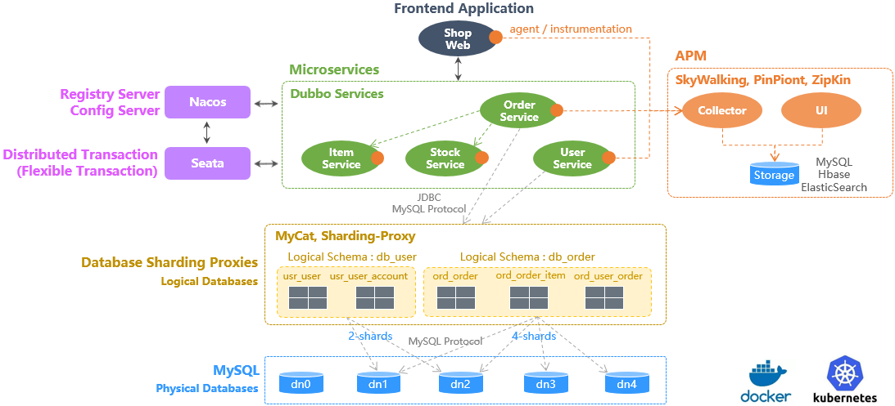

-------------------------------------------------------------------
#### 架构
 <br />

##### 数据库水平拆分
使用Mycat分库分表：
- Mycat实现了MySQL协议，MySQL命令行客户端、任何开发语言都能像直接连接MySQL一样连接Mycat，对客户端透明，支持所有开发语言；
- Mycat解析SQL语句，根据SQL参数和分片规则进行路由，跨分片查询对结果集进行汇总、重排序、分页、聚合等，将分库分表、读写分离等数据存储伸缩方案与应用隔离；

Mycat部署和使用参考[MyCat Sharding](https://github.com/liuzhibin-cn/my-demo/blob/master/docs/Mycat-Sharding.md)

##### APM全链路监控
演示项目支持[PinPoint](https://github.com/naver/pinpoint)、[SkyWalking](http://skywalking.apache.org/)、[ZipKin](https://zipkin.io/)三种APM工具进行全链路跟踪和性能分析，通过不同maven profile打包即可，具体参考项目代码和：[PinPoint部署和使用](https://github.com/liuzhibin-cn/my-demo/blob/master/docs/APM-PinPoint.md)、[SkyWalking部署和使用](https://github.com/liuzhibin-cn/my-demo/blob/master/docs/APM-SkyWalking.md)、[ZipKin部署和使用](https://github.com/liuzhibin-cn/my-demo/blob/master/docs/APM-ZipKin.md)

三种APM工具对比：
- 使用方式：PinPoint和SkyWalking都采用javaagent方式，对应用代码几乎没有侵入性；ZipKin需要和应用打包到一起，并在应用中完成各种配置，属于强依赖关系；
- 链路跟踪能力：整体上看相差不大，基本都参照[Google Dapper](http://research.google.com/pubs/pub36356.html)，也都支持对大量主流框架的跟踪，细节上有些差异：
  - 对单次RPC调用分析，ZipKin定义的Annotations更精细，参考[ZipKin部署和使用](https://github.com/liuzhibin-cn/my-demo/blob/master/docs/APM-ZipKin.md)；
  - PinPoint和SkyWalking都提供将额外方法添加到调用链跟踪的功能，其中PinPoint对代码完全没有侵入性，SkyWalking则需要对方法添加注解；
  - SkyWalking支持在Span中添加自定义tag功能，利用该功能可以将方法参数值等额外信息记录到Span中，有利于问题分析；
- UI功能：PinPoint和SkyWalking UI功能比较丰富，都提供应用/服务、实例等层级的性能统计，两者各有特色；ZipKin UI功能最弱，只提供依赖关系、具体调用链查看分析；<br />
  额外的UI功能，可以读取APM工具的数据，自定义开发；
- 社区支持：ZipKin架构灵活、文档完善，社区支持度最高，Spring Cloud和Service Mesh（[istio](https://github.com/istio/)）官方提供ZipKin支持；SkyWalking是华为员工开发，已成为Apache项目，从官方文档的英文水平看，在国外不一定能获得太高支持；PinPoint为韩国公司开源；

-------------------------------------------------------------------
#### 运行演示项目
1. JDK8+，部署好Redis（用于Dubbo注册中心）、MySQL、Mycat；
   创建数据库、表，部署配置Mycat参考[MyCat Sharding](https://github.com/liuzhibin-cn/my-demo/blob/master/docs/Mycat-Sharding.md)。
2. 修改项目配置：<br />
   方便起见配置信息全放在[parent pom](https://github.com/liuzhibin-cn/my-demo/blob/master/pom.xml)的`dev` profile中，修改这里即可。
3. 编译打包：<br />
   运行[package.sh](https://github.com/liuzhibin-cn/my-demo/blob/master/package.sh)，脚本会install parent pom和`service-client`，然后编译打包其它服务和应用。
4. 运行演示项目：<br />
   依次启动`item-service`、`stock-service`、`user-service`、`order-service`，最后启动`shop-web`:
   ```sh
   java -jar item-service\target\item-service-0.0.1-SNAPSHOT.jar
   java -jar stock-service\target\stock-service-0.0.1-SNAPSHOT.jar
   java -jar user-service\target\user-service-0.0.1-SNAPSHOT.jar
   java -jar order-service\target\order-service-0.0.1-SNAPSHOT.jar
   java -jar shop-web\target\shop-web-0.0.1-SNAPSHOT.jar
   ```
6. 通过[http://localhost:8090](http://localhost:8090)访问，执行操作查看效果；

-------------------------------------------------------------------
#### Dubbo基础用法
使用[apache/dubbo-spring-boot-project](https://github.com/apache/dubbo-spring-boot-project)与SpringBoot集成，注册中心使用Redis。

1. `pom.xml`添加依赖项：
   ```xml
   <dependency>
        <groupId>org.apache.dubbo</groupId>
        <artifactId>dubbo-spring-boot-starter</artifactId>
        <version>2.7.4.1</version>
   </dependency>
   <dependency>
     <groupId>org.apache.dubbo</groupId>
     <artifactId>dubbo</artifactId>
     <version>2.7.4.1</version>
   </dependency>
   <dependency> <!-- dubbo: serialization -->
     <groupId>de.ruedigermoeller</groupId>
     <artifactId>fst</artifactId>
     <version>2.57</version>
   </dependency>
   <dependency> <!-- dubbo: use redis registry, dubbo uses jedis client -->
       <groupId>redis.clients</groupId>
       <artifactId>jedis</artifactId>
   </dependency>
   ```
2. 在`application.yml`中配置protocol、registry等：
   ```yaml
   dubbo:
       application:
           id: srv-item
           name: srv-item
           qosEnable: false
        protocol:
            id: dubbo
            name: dubbo
            port: 20880
            threads: 3
            iothreads: 1
            server: netty
            client: netty
            status: server
            serialization: fst
            queues: 0
            keepAlive: true
        registry: 
            id: redis
            address: redis://127.0.0.1:6379
   ```
   最新配置项参考[ApplicationConfig](https://github.com/apache/dubbo/blob/master/dubbo-common/src/main/java/org/apache/dubbo/config/ApplicationConfig.java)、[ProtocolConfig](https://github.com/apache/dubbo/blob/master/dubbo-common/src/main/java/org/apache/dubbo/config/ProtocolConfig.java)、[RegistryConfig](https://github.com/apache/dubbo/blob/master/dubbo-common/src/main/java/org/apache/dubbo/config/RegistryConfig.java)、[MonitorConfig](https://github.com/apache/dubbo/blob/master/dubbo-common/src/main/java/org/apache/dubbo/config/MonitorConfig.java)、[ServiceConfig](https://github.com/apache/dubbo/blob/master/dubbo-config/dubbo-config-api/src/main/java/org/apache/dubbo/config/ServiceConfig.java)、[ReferenceConfig](https://github.com/apache/dubbo/blob/master/dubbo-config/dubbo-config-api/src/main/java/org/apache/dubbo/config/ReferenceConfig.java)
3. SpringBoot启动类上指定Dubbo组件扫描范围：
   ```java
   @Configuration
   @EnableAutoConfiguration
   @ComponentScan(basePackages={"my.demo.service.item"})
   @DubboComponentScan(basePackages = { "my.demo.service.item" })
   public class Application {
	   public static void main(String[] args) {
		   new SpringApplicationBuilder(Application.class)
			   .web(WebApplicationType.NONE).run(args);
	   }
   }
   ```
4. 暴露Dubbo服务的类上使用`@Service`注解（不再需要Spring的`@Component`），引用Dubbo服务使用`@Reference`（不再需要Spring的`@Autowired`）；
